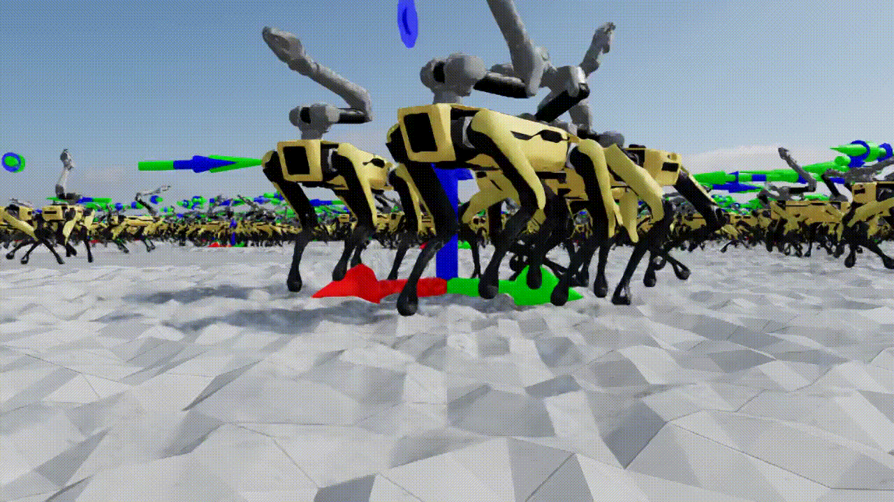

# IsaacRobotics Applications

[](LICENSE)
[](https://github.com/mschweig/IsaacRobotics/stargazers)
[](https://github.com/mschweig/IsaacRobotics/issues)
[](https://github.com/mschweig/IsaacRobotics/commits/main)

**Reinforcement Learning-Controlled Robotics Simulation for Spot and Spot Arm based on NVIDIA Isaac Sim and Isaac Lab**

---

## Overview

This project provides simulation applications, RL policy controllers, and a data collection dashboard for Boston Dynamics Spot in NVIDIA Isaac Sim. It supports keyboard teleoperation, autonomous navigation using hierarchical RL policies trained in Isaac Lab, and imitation learning data collection with a real-time web dashboard.

---

## Features

- Spot (12 DoF) and Spot Arm (19 DoF) in warehouse environments
- Keyboard teleoperation in Isaac Sim
- **Autonomous navigation** using a hierarchical policy (nav policy → locomotion policy)
- **Data collection dashboard** — real-time web UI for recording teleoperation as HDF5 datasets
- Isaac Lab policy import — plug in your own `.pt` exported policies
- Optional ROS 2 bridge integration

---

## Requirements

- NVIDIA Isaac Sim 5.0 (standalone, path: `~/isaac-sim-standalone-5.0.0-linux-x86_64/`)
- GPU: NVIDIA RTX 40xx or better
- Node.js 18+ (for the dashboard frontend)
- (Optional) ROS 2 Humble + rmw_zenoh

---

## Installation

### 1. Clone the repository

```bash
git clone https://github.com/mschweig/IsaacRobotics.git
cd IsaacRobotics
```

### 2. Install Python dependencies into Isaac Sim's Python

```bash
~/isaac-sim-standalone-5.0.0-linux-x86_64/python.sh -m pip install \
    fastapi "uvicorn[standard]" h5py websockets
```

### 3. Install dashboard frontend dependencies

```bash
cd dashboard/frontend
npm install
```

---

## Project Structure

```
IsaacRobotics/
├── applications/
│   ├── spot_policy.py                  # Policy controller classes
│   ├── spot_warehouse.py               # Spot Arm teleoperation (original)
│   ├── spot_warehouse_dashboard.py     # Teleoperation + data collection dashboard
│   └── spot_nav_demo.py                # Teleop + autonomous navigation (--mode flag)
│
├── policies/
│   ├── spot/                           # Pre-trained Spot 12 DoF policy
│   ├── spot_arm/                       # Pre-trained Spot Arm 19 DoF policy
│   ├── spot_flat/                      # Isaac Lab-trained flat terrain policy
│   └── spot_nav/                       # Isaac Lab-trained navigation policy
│
├── assets/
│   ├── spot.usd                        # Spot 12 DoF robot model
│   └── spot_arm.usd                    # Spot Arm 19 DoF robot model
│
├── dashboard/
│   ├── backend/
│   │   ├── main.py                     # FastAPI server (WebSocket + REST)
│   │   ├── recorder.py                 # HDF5 episode recorder
│   │   └── state_bridge.py             # Thread-safe Isaac Sim ↔ FastAPI bridge
│   └── frontend/                       # React + Vite dashboard UI
│
└── data/
    └── recordings/                     # Saved HDF5 datasets (auto-created)
```

---

## Applications

All applications run through Isaac Sim's Python interpreter:

```bash
cd ~/isaac-sim-standalone-5.0.0-linux-x86_64
./python.sh /path/to/IsaacRobotics/applications/<script>.py
```

### 1. `spot_warehouse.py` — Spot Arm Teleoperation

The original warehouse demo with Spot Arm (19 DoF).

```bash
./python.sh /home/yeseul/IsaacRobotics/applications/spot_warehouse.py
```

### 2. `spot_warehouse_dashboard.py` — Teleoperation + Data Collection

Same as above, but with a live web dashboard for recording teleoperation episodes as HDF5 datasets for imitation learning.

```bash
# Terminal 1: Isaac Sim
./python.sh /home/yeseul/IsaacRobotics/applications/spot_warehouse_dashboard.py

# Terminal 2: React dev server
cd /home/yeseul/IsaacRobotics/dashboard/frontend
npm run dev
```

Open `http://localhost:5173` in your browser.

### 3. `spot_nav_demo.py` — Teleoperation + Autonomous Navigation

Supports two modes using your own Isaac Lab-trained policies.

```bash
# Teleoperation mode (keyboard control, 12 DoF Spot, custom flat terrain policy)
./python.sh /home/yeseul/IsaacRobotics/applications/spot_nav_demo.py --mode teleop

# Navigation mode (type x y target coordinates, robot walks autonomously)
./python.sh /home/yeseul/IsaacRobotics/applications/spot_nav_demo.py --mode nav
```

In navigation mode, type target coordinates in the terminal:
```
Enter target x y: 5 0
[Nav] New target set: (5.00, 0.00)
[Nav] pos=(0.94,0.11) target=(5.00,0.00) dist=4.07m | cmd=[1.20,0.01,-0.30]
```

---

## Keyboard Controls

Controls apply to all teleoperation applications. **Click the Isaac Sim viewport window first to give it keyboard focus.**

| Key | Command |
|-----|---------|
| ↑ / NUMPAD 8 | Move forward |
| ↓ / NUMPAD 2 | Move backward |
| ← / NUMPAD 4 | Strafe left |
| → / NUMPAD 6 | Strafe right |
| N / NUMPAD 7 | Rotate left (CCW) |
| M / NUMPAD 9 | Rotate right (CW) |

---

## Data Collection Dashboard

The dashboard connects to Isaac Sim via a thread-safe queue and streams robot state to the browser over WebSocket at 10 Hz.

### Architecture

```
Isaac Sim (200 Hz physics)
  │  push_state() every 20 Hz (policy frequency)
  ▼
StateManager (thread-safe queue)
  │
  ▼
FastAPI server (port 8000)
  ├── WebSocket /ws ──────► React frontend (10 Hz)
  ├── POST /api/record/start
  ├── POST /api/record/stop
  └── GET  /api/episodes
        │
        ▼
    HDF5Recorder
        │
        ▼
  data/recordings/session_YYYYMMDD_HHMMSS.h5
```

### Dashboard Tabs

| Tab | Content |
|-----|---------|
| 🤖 Robot State | Real-time joint position/velocity graphs (19 joints), velocity command bars, robot pose |
| 📹 Data Collection | Start/Stop recording button, episode list, file size |
| 📊 Training Monitor | Placeholder (coming soon) |

### Recording an Episode

1. Start Isaac Sim with `spot_warehouse_dashboard.py`
2. Open `http://localhost:5173`
3. Teleoperate Spot using keyboard (click the sim window first)
4. Click **▶ Start Recording** in the dashboard
5. Drive the robot — each timestep is buffered in memory
6. Click **⏹ Stop Recording** — episode is flushed to HDF5

---

## HDF5 Data Format

Each session creates one `.h5` file in `data/recordings/`. Episodes are stored as groups:

```
session_20260303_143000.h5
├── episode_0000/
│   ├── timestamps  (N,)    float64  — Unix timestamps
│   ├── obs         (N, 69) float32  — Full observation vector
│   ├── actions     (N, 19) float32  — RL policy action output
│   ├── commands    (N, 3)  float32  — [v_x, v_y, w_z] teleop command
│   └── poses       (N, 7)  float32  — [x, y, z, qw, qx, qy, qz]
├── episode_0001/
│   └── ...
└── attrs: robot_type="SpotArm", obs_dim=69, action_dim=19
```

### Loading Data (PyTorch)

```python
import h5py
import torch

with h5py.File("data/recordings/session_xxx.h5", "r") as f:
    for ep_name in f.keys():
        obs     = torch.tensor(f[ep_name]["obs"][:])      # (N, 69)
        actions = torch.tensor(f[ep_name]["actions"][:])  # (N, 19)
        commands = torch.tensor(f[ep_name]["commands"][:]) # (N, 3)
        poses   = torch.tensor(f[ep_name]["poses"][:])    # (N, 7)
        print(f"{ep_name}: {obs.shape[0]} steps, {f[ep_name].attrs['duration_sec']:.1f}s")
```

---

## Policy Architecture

### Observation Vectors

| Policy | DoF | Obs dim | Structure |
|--------|-----|---------|-----------|
| SpotFlatTerrainPolicy | 12 | 48 | `[lin_vel_b(3), ang_vel_b(3), gravity_b(3), command(3), joint_pos(12), joint_vel(12), prev_action(12)]` |
| SpotArmFlatTerrainPolicy | 19 | 69 | `[lin_vel_b(3), ang_vel_b(3), gravity_b(3), command(3), joint_pos(19), joint_vel(19), prev_action(19)]` |
| SpotNavigationPolicy | — | 9 | `[lin_vel_b(3), gravity_b(3), pose_command(3)]` → outputs `[v_x, v_y, w_z]` |

### Navigation Policy (Hierarchical)

```
Navigation Policy (every 100 physics steps ≈ 0.5 Hz)
  obs: [lin_vel_b, gravity_b, pose_command]
  out: [v_x, v_y, w_z]  ← velocity command
        │
        ▼
Locomotion Policy (every 10 physics steps ≈ 20 Hz)
  obs: [lin_vel_b, ang_vel_b, gravity_b, command, joint_pos, joint_vel, prev_action]
  out: joint_pos_target = default_pos + action × 0.2
```

### Using Your Own Isaac Lab Policies

Copy exported policies from your Isaac Lab training runs:

```bash
# Flat terrain locomotion policy
cp ~/IsaacLab/logs/rsl_rl/spot_flat/<run>/exported/policy.pt policies/spot_flat/models/
cp ~/IsaacLab/logs/rsl_rl/spot_flat/<run>/params/env.yaml   policies/spot_flat/params/

# Navigation policy
cp ~/IsaacLab/logs/rsl_rl/spot_navigation/<run>/exported/policy.pt policies/spot_nav/models/
cp ~/IsaacLab/logs/rsl_rl/spot_navigation/<run>/params/env.yaml    policies/spot_nav/params/
```

---

## Media

### Spot Arm Policy



---

## License

This project is licensed under the Apache License 2.0. See [LICENSE](LICENSE) for details.

NVIDIA proprietary code (e.g., RL policies) remains under NVIDIA's licensing terms.
